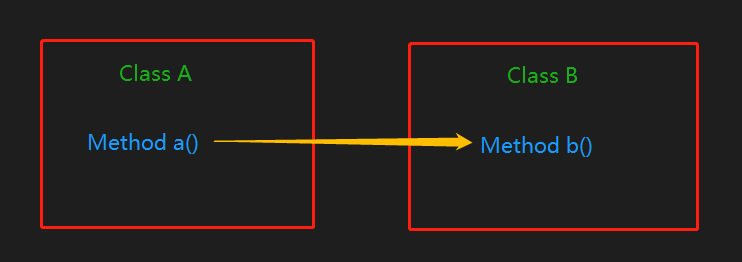
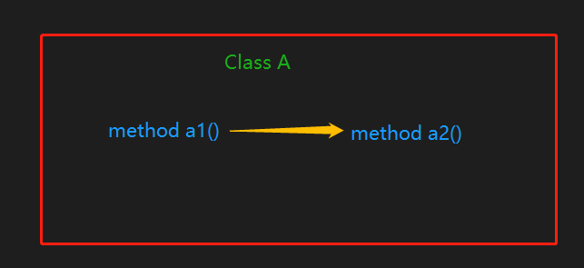

# Mock入门

[java的mock框架](https://site.mockito.org/)，[其文档](https://static.javadoc.io/org.mockito/mockito-core/2.23.0/org/mockito/Mockito.html)

[参考](https://zhuanlan.zhihu.com/p/21444517)

## 依赖的2种情况

1. 一个类的方法依赖另一个类的方法



2. 同一个类的方法间依赖



```java
public class A {

	private B b;

	public String a() {
		return b.b();
	}

	public String a1() {
		return a2();
	}

	public String a2() {
		return "a2";
	}
}

public class B {
	public String b() {
		return "this is b";
	}
}
```

## Mock使用
### 引入依赖
```maven
        <!-- https://mvnrepository.com/artifact/org.mockito/mockito-core -->
        <dependency>
            <groupId>org.mockito</groupId>
            <artifactId>mockito-core</artifactId>
            <version>2.23.0</version>
            <scope>test</scope>
        </dependency>

        <dependency>
            <groupId>junit</groupId>
            <artifactId>junit</artifactId>
            <version>4.12</version>
        </dependency>
```
需要注意的就是：springboot的`spring-boot-starter-test`以及包含junit和mockito依赖。

### 如何模拟一个对象

#### 原生方法
以List为例，使用mock方法即可：
```java
 import static org.mockito.Mockito.*;

 //mock creation
 List mockedList = mock(List.class);

 //using mock object
 mockedList.add("one");
 mockedList.clear();

 //verification
 verify(mockedList).add("one");
 verify(mockedList).clear();
```
#### 依赖情况1
或者使用注解：

[文档](https://static.javadoc.io/org.mockito/mockito-core/2.23.0/org/mockito/InjectMocks.html) ,
`@InjectMocks只会注入使用@Spy或@Mock注释创建的mock/spy对象`

1. 构造函数注入
2. setter注入
3. 字段注入

```java
public class ATest {

	// 被测对象
	@InjectMocks
	private A a;

	// 被引用的对象，需要模拟的
	@Mock
	private B b;

	@Before
	public void init() throws Exception {
		// 使注解生效，可以继承
		MockitoAnnotations.initMocks(this);
	}

	@Test
	public void a() {
		when(b.b()).thenReturn("bb");
		final String s = this.a.a();

		assertEquals("bb", s);
	}
}
```

#### 依赖情况2
这时候创建被测类的spy对象，才可以模拟其方法：
```java
	@Test
	public void a1() {
		// 模拟A类的a2方法, 创建a的spy对象，只部分化a对象
		a = spy(a);
		when(a.a2()).thenReturn("aa");
//		或者：doReturn("aaa").when(a).a2();
		assertEquals("aaa", a.a1());
	}
```

#### JUnit+Mockito
当然，在junit测试框架下，我们可以完全使用注解：
```java
@RunWith(MockitoJUnitRunner.class)
public class ATest {

	// 被测对象
	@InjectMocks
	private A a;

	// 被引用的对象
	@Mock
	private B b;
}
```

### 模拟方法返回值
这是我们最常用的：
```java
	@Test(expected = RuntimeException.class)
	public void stub() {
		// 创建模拟的LinkedList
		LinkedList mockedList = mock(LinkedList.class);

		// 模拟返回值（stub）
		when(mockedList.get(0)).thenReturn("first");
		// 模拟抛异常
		when(mockedList.get(1)).thenThrow(new RuntimeException());

		assertEquals("first", mockedList.get(0));

		// 第99个元素没有被模拟，所以返回null
		assertNull(mockedList.get(99));

		// 抛异常
		mockedList.get(1);
	}
```

### 模拟方法参数
有时我们不关心参数的值，只需要随便给一个，mock可以随机一些：
```java
	@Test
	public void arguments() {
		// 创建模拟的LinkedList
		LinkedList mockedList = mock(LinkedList.class);

		// 不管参数是什么（必须是int），都返回element
		when(mockedList.get(anyInt())).thenReturn("element");

		assertEquals("element", mockedList.get(3));
		assertEquals("element", mockedList.get(999));
	}
```
当然，除了anyInt(),还有其他类型：Stirng,Short,Char,List,Set,Map,Iterable,参考源码：`org.mockito.ArgumentMatchers`.

或者我们自定义参数条件
```java
	@Test
	public void arg() {
		class ListOfTwoElements implements ArgumentMatcher<List> {
			public boolean matches(List list) {
				return list.size() == 2;
			}
			public String toString() {
				//printed in verification errors
				return "[list of 2 elements]";
			}
		}

		List mock = mock(List.class);

    // 也可以用lambda表达式 list -> list.size()>2
		when(mock.addAll(argThat(new ListOfTwoElements()))).thenReturn(true);

		assertTrue(mock.addAll(Arrays.asList("one", "two")));
		assertFalse(mock.addAll(Arrays.asList("one", "two", "three")));
	}
```

### 验证方法的调用次数

```java
	@Test
	public void timesTest() {
		// 创建模拟的LinkedList
		LinkedList mockedList = mock(LinkedList.class);

		mockedList.add("once");

		mockedList.add("twice");
		mockedList.add("twice");

		mockedList.add("three times");
		mockedList.add("three times");
		mockedList.add("three times");

		// 默认是一次
		verify(mockedList).add("once");
		verify(mockedList, times(1)).add("once");

		verify(mockedList, times(2)).add("twice");
		verify(mockedList, times(3)).add("three times");

		// never(). never() == times(0)
		verify(mockedList, never()).add("never happened");

		// 还有至少和至多多少次：atLeast()/atMost()
		verify(mockedList, atLeastOnce()).add("three times");
		verify(mockedList, atLeast(2)).add("three times");
		verify(mockedList, atMost(5)).add("three times");
	}
```
好理解，但是为什么需要？

假如我们的被测方法存在一个循环，循环里有条件判断，可以判断某个方法因为条件的不同执行的次数。

### doXxxx方法
[文档](https://static.javadoc.io/org.mockito/mockito-core/2.23.0/org/mockito/Mockito.html#do_family_methods_stubs)

一般来说，`when().thenReturn()`基本能满足需求，所以什么时候需要使用do系列方法？

1. 模拟void的方法
2. 模拟spy对象，上面
3. 在一个测试中多次修改一个方法的行为

说一下多次修改一个方法的返回值：
```java
	@Test
	public void getInstanceInfoActive() {
		when(openstackService.execute(anyString(), anyString(), anyString(), anyString(),
				anyString(), anyString(), argThat(s -> !s.contains("&marker=")))).thenReturn(getOneServerJson(2));
//		doReturn(getOneServerJson(2)).when(openstackService).execute(anyString(), anyString(), anyString(), anyString(),
//				anyString(), anyString(), argThat(s -> !s.contains("&marker=")));
		final int count = service.getInstanceInfoActive("", "", "", "");
		assertEquals(2, count);

		// 模拟返回超过1000条数据
		doReturn(getOneServerJson(1000)).when(openstackService).execute(anyString(), anyString(), anyString(), anyString(),
				anyString(), anyString(), argThat(s -> !s.contains("&marker=")));
		doReturn(getOneServerJson(999)).when(openstackService).execute(anyString(), anyString(), anyString(), anyString(),
				anyString(), anyString(), argThat(s -> s.contains("&marker=")));
//		when(openstackService.execute(anyString(), anyString(), anyString(), anyString(),
//				anyString(), anyString(), argThat(s -> s.contains("&marker=")))).thenReturn(getOneServerJson(999));
		final int count2 = service.getInstanceInfoActive("", "", "", "");
		assertEquals(1999, count2);
	}
```


### 方法没有返回值
理论上应该抛出异常，否则就是方法本身不可测了。

### 方法是私有的
mockito框架不支持测试私有方法，[原因](https://github.com/mockito/mockito/wiki/Mockito-And-Private-Methods)

但有另一个强大的框架：[powermock](https://github.com/powermock/powermock),可以[测试私有方法](https://github.com/powermock/powermock/wiki/MockPrivate)。

修改权限：改为包权限。

### 其他
参考文档：
[https://static.javadoc.io/org.mockito/mockito-core/2.23.0/org/mockito/Mockito.html](https://static.javadoc.io/org.mockito/mockito-core/2.23.0/org/mockito/Mockito.html)


# 为什么使用Mock

1. Mockito是一个非常好的模拟框架。它允许您使用简洁的API编写漂亮的测试。 Mockito不会让你糊涂，因为测试非常易读并且会产生干净的验证错误。

2. StackOverflow社区将Mockito评为最佳的java模拟框架。尽管StackOverflow避开可能引发情绪争论的问题，但事实上Mockito获得的选票最多。
3. 所有库中的前10个Java库，不仅仅是测试工具。 2013年底，对30,000个GitHub项目进行了分析。尽管Mockito在主报告中排名第9，但mockito-core和mockito-all都是相同的工具，因此Mockito的实际位置是4号，超过了Guava或Spring等著名工具。将这项研究视为Mockito每天用Java编写的单元测试所产生巨大影响的指标。

4. 行为驱动开发的创始人Dan North在2008年写道：
  “我们在主会议期间决定使用JUnit 4和Mockito，因为我们认为它们是TDD和Java中Mock的未来”

# Spring中的Mock

[spring-boot官方测试文档](https://docs.spring.io/spring-boot/docs/current/reference/html/boot-features-testing.html)

spring-boot包含的测试依赖

mock在spring中的分类和使用


# ScalaTest+Mock

官方文档：[http://www.scalatest.org/user_guide/testing_with_mock_objects](http://www.scalatest.org/user_guide/testing_with_mock_objects)

scala的mock有4种常用框架：


scala-mock是scala原生支持的：[http://scalamock.org/quick-start/](http://scalamock.org/quick-start/)

